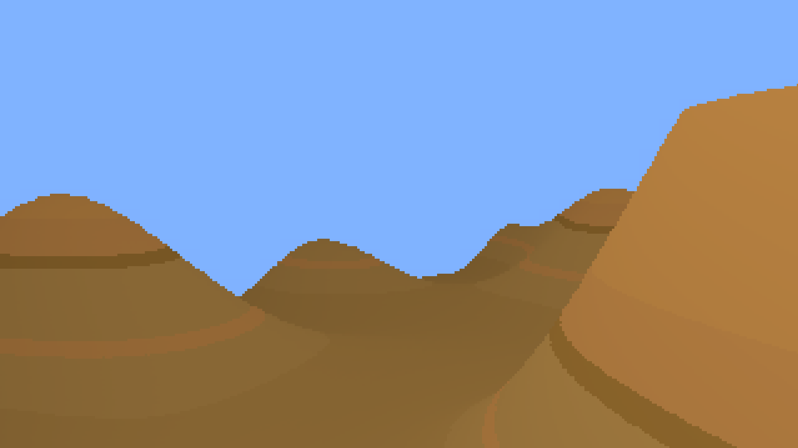

# Pixelated Plane Simulator

## Controls
__Basic controls:__
- `W`/`D` => pitch up/down
- `Q`/`E` => yaw left/right
- `A`/`D` => roll left/right

__Other controls:__
- `R` => regenerate terrain
- `P` => toggle pixelation effect

## Description

This program simulates flight through procedurally-generated mesa terrain, with a retro pixelation effect.

This is built off of my final project for CS 4300 Computer Graphics at Northeastern.

## Dependencies

OpenGL, GLM, SDL2

  
## How to run 

Run `python3 build.py` to build. Then, run `./plane`.

## Future updates
- [ ] Add third person perspective
- [ ] Add airplane obj/mtl
- [ ] Add flight physics 
